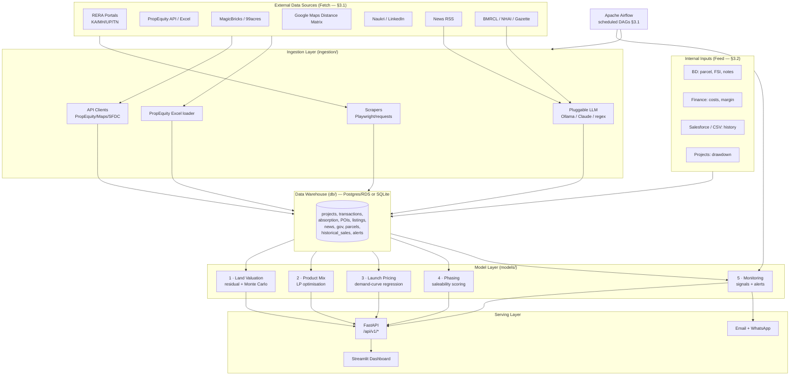

# Architecture & Tech Stack

## System overview

## Layered design

1. **Ingestion** (`ingestion/`) — scrapers (`scrapers/`), API clients (`apis/`),
   the PropEquity Excel loader (`propequity_excel.py`), and the pluggable LLM
   provider (`llm/`). Every adapter is key/flag-driven and degrades to the
   warehouse when a source is unavailable, so the system is always runnable.
2. **Warehouse** (`db/`) — one SQLAlchemy schema (`schema.py`) over Postgres
   (production / AWS RDS) or SQLite (local). Swapped purely via `DATABASE_URL`.
3. **Models** (`models/`) — the five sub-modules, plus shared market-data access
   (`market_data.py`) and alerting (`alerting.py`). Pure Python/NumPy/SciPy/
   scikit-learn; no I/O beyond the warehouse.
4. **Serving** — FastAPI (`api/`) exposes every module as a validated REST
   endpoint; Streamlit (`dashboard/`) is the GPL-facing UI calling the model
   layer directly.
5. **Orchestration** — Airflow DAGs (`airflow/dags/`) run ingestion and
   monitoring on the Section-3.1 schedules and alert the admin on failure.

## Technology stack (vs brief §5.2)

| Layer | Chosen | Brief recommendation | Note |
|---|---|---|---|
| Warehouse | PostgreSQL (RDS) / SQLite local | Snowflake **or** Postgres | Postgres chosen for MVP cost (brief permits). Snowflake-ready via `DATABASE_URL`. |
| Structured ingestion | Custom API clients | Fivetran/Airbyte | Lightweight, no per-row cost; Airbyte can wrap these later. |
| Scraping | requests + Playwright | Scrapy/Playwright | Playwright for JS portals; requests for static RERA. |
| Modelling | NumPy, SciPy, scikit-learn | same | Interpretable (LinearRegression, linprog, MC). |
| LLM | Ollama (preferred) / Claude / regex | Self-hosted Llama/Mistral **or** Claude | Pluggable; default offline regex. |
| Orchestration | Apache Airflow | Airflow / Step Functions | Self-hosted DAGs. |
| Backend | FastAPI | FastAPI | As recommended. |
| Frontend | Streamlit | Streamlit (MVP) | As recommended; React is the later production option. |
| Alerting | SendGrid + Interakt/Gupshup | same | Console fallback when unconfigured. |
| Hosting | AWS EC2 + RDS + S3 | AWS/Azure | See DEPLOYMENT.md. |

## Performance (brief §5.3)

- Land valuation incl. 10k Monte Carlo runs completes in **well under 90s**
  (NumPy-vectorised; ~sub-second on the bundled datasets).
- Pre-computed dashboard views load under 3s (cached micro-market lists).
- Airflow handles unattended refresh; failures alert the admin within SLA.
- Stateless FastAPI scales horizontally for 20+ concurrent users.
