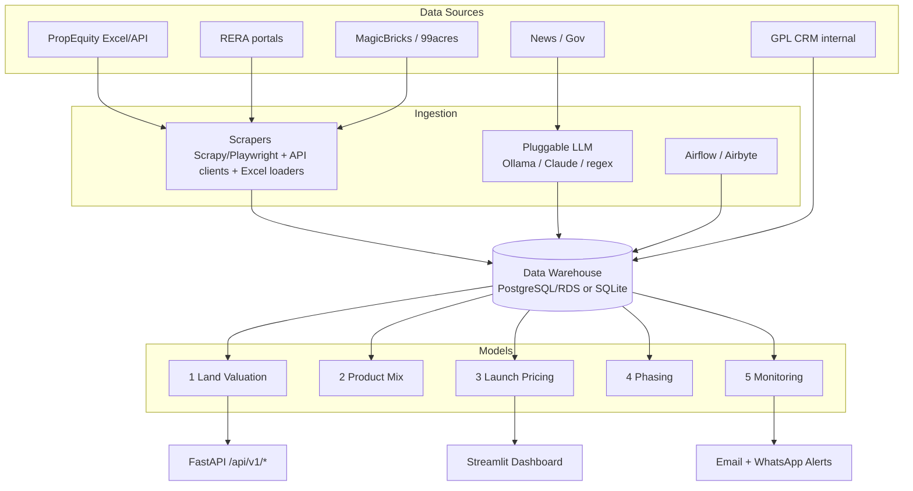
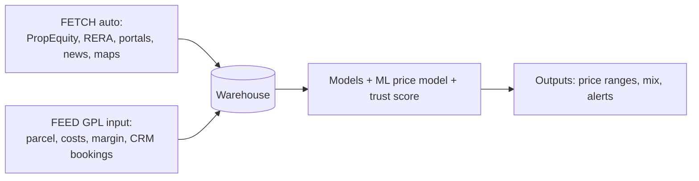
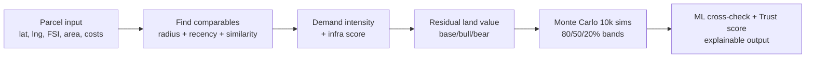

# Mermaid Source (fallback)

The submission uses pre-rendered PNGs (`architecture.png`, `data_flow.png`,
`valuation_pipeline.png`). If you prefer to regenerate them in Mermaid
(e.g. mermaid.live), here is the equivalent source.

## 1. System architecture

## 2. Data flow

## 3. Land-valuation pipeline

